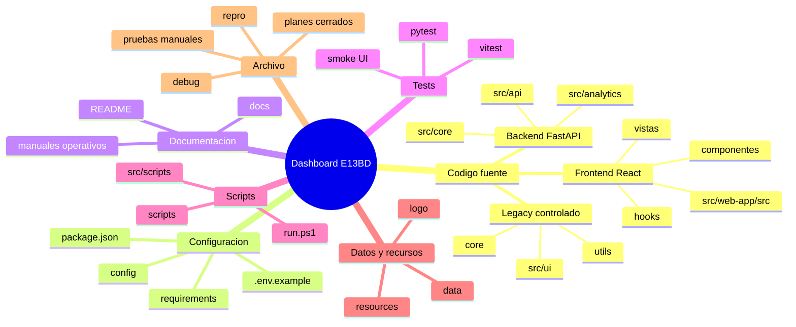
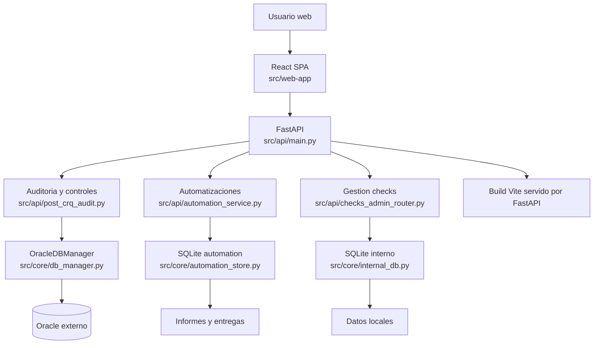
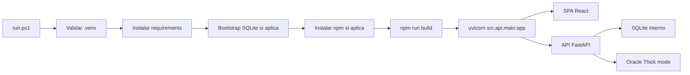

# Estructura del proyecto

## 1. Objetivo del documento

Este documento explica la estructura actual del repositorio Dashboard E13BD despues de la reorganizacion conservadora de carpetas. Sirve como guia de incorporacion tecnica y como referencia para decidir donde ubicar nuevo codigo, scripts, recursos, tests y documentacion sin romper rutas funcionales existentes.

## 2. Resumen general del proyecto

| Aspecto | Valor |
|---|---|
| Tipo de aplicacion | Aplicacion full-stack interna para auditoria Oracle, controles post-CRQ y automatizaciones de informes |
| Lenguaje principal | Python en backend; JavaScript/JSX en frontend |
| Framework principal | FastAPI para API; React 19 + Vite para SPA |
| Punto de entrada backend | `src/api/main.py` |
| Punto de entrada frontend | `src/web-app/src/main.jsx` |
| Arranque integrado | `.\run.ps1` |
| Instalacion Python | `.\.venv\Scripts\python.exe -m pip install -r requirements.txt` |
| Instalacion frontend | `cd src/web-app; npm install` |
| Ejecucion local | `.\run.ps1` |
| Tests backend | `.\.venv\Scripts\python.exe -m pytest` |
| Tests frontend | `cd src/web-app; npm run test` |
| Lint frontend | `cd src/web-app; npm run lint` |
| Build frontend | `cd src/web-app; npm run build` |

## 3. Estructura general de carpetas

```text
.
├── archive/
│   ├── assets/
│   ├── debug/
│   ├── maintenance/
│   ├── manual-tests/
│   ├── misc/
│   ├── plans/
│   └── repro/
├── config/
├── core/
├── data/
├── docs/
├── logo/
├── resources/
│   ├── bootstrap/
│   ├── fonts/
│   └── manuals/
├── scripts/
├── src/
│   ├── analytics/
│   ├── api/
│   ├── core/
│   ├── db/
│   ├── scripts/
│   ├── ui/
│   └── web-app/
├── tests/
├── utils/
├── AGENTS.md
├── README.md
├── auditoria_post_crq.md
├── consultes_post_crq.txt
├── EXPLICACION_CHECKS_CONTROL_QUALITAT_CRQ.md
├── AUDITORIA_BBDD_DOC.md
├── main.py
├── dashboard.py
├── requirements.txt
├── run.ps1
└── run-clean.ps1
```

## 4. Explicacion de cada carpeta

| Carpeta | Proposito | Que contiene | Cuando modificarla |
|---|---|---|---|
| `src/api/` | Backend HTTP y servicios de aplicacion | FastAPI, routers, auditorias, generadores de informes, automatizaciones | Al crear o cambiar endpoints, flujos post-CRQ o servicios backend |
| `src/core/` | Nucleo compartido backend | Acceso Oracle, SQLite interno, carga de configuracion, IA, utilidades de dominio | Al cambiar persistencia, configuracion, clientes externos o logica reusable |
| `src/analytics/` | Consultas y scoring analitico | Queries Oracle y motor de puntuacion | Al ajustar analisis de obsolescencia o metricas |
| `src/web-app/` | Frontend React/Vite | SPA, vistas, hooks, componentes, tests de UI | Al modificar experiencia web o llamadas API desde frontend |
| `src/scripts/` | Scripts Python ligados al paquete `src` | Importaciones y tareas de mantenimiento internas | Si el script depende de modulos `src.*` |
| `scripts/` | Automatizaciones operativas del repo | Bootstrap, regresion, proxy dev, backups, smoke backend | Al anadir tareas CLI del proyecto |
| `tests/` | Suite pytest oficial | Tests unitarios e integracion backend | Al cubrir cambios de backend o reglas de negocio |
| `resources/` | Recursos versionados de soporte | Bootstrap publico, manuales, fuentes, imagenes de informes | Al actualizar datos iniciales publicos o recursos estaticos no generados |
| `config/` | Configuracion de ejemplo y plantillas | `config.yaml`, `report_identity.json`, plantilla de conexiones | Al cambiar defaults no secretos o plantillas |
| `data/` | Datos versionados de ejemplo o snapshots controlados | Snapshots/parquet y versiones documentales incluidas en repo | Solo si el dato debe reproducirse en otros entornos |
| `docs/` | Documentacion tecnica del proyecto | Este documento y futuras guias de arquitectura | Al cambiar estructura, arquitectura o convenciones |
| `archive/` | Material auxiliar conservado fuera de la raiz | Debugs, repros, pruebas manuales, planes cerrados, assets sueltos | Solo para consultar historico o recuperar scripts no operativos |
| `core/` | Esqueleto legacy previo | Adaptadores y parser de la version inicial | Evitar nuevas altas; preferir `src/core/` |
| `utils/` | Utilidades legacy previas | Logger y generacion simple de reportes | Evitar nuevas altas; preferir `src/core/` o `src/api/` |
| `logo/` | Imagenes institucionales | Logos usados en UI o informes | Al actualizar identidad visual |

## 5. Mapa mental general



## 6. Mapa de arquitectura



## 7. Flujo de ejecucion

1. `run.ps1` verifica o crea `.venv`.
2. Instala dependencias Python desde `requirements.txt`.
3. Ejecuta bootstrap inicial si `BOOTSTRAP_INITIAL_DATA` no esta desactivado.
4. Instala dependencias frontend si falta `node_modules`.
5. Ejecuta `npm run build` en `src/web-app`.
6. Arranca `uvicorn src.api.main:app` en `http://127.0.0.1:8000`.
7. FastAPI sirve la SPA y expone endpoints para perfiles, auditorias, checks, jobs e informes.
8. Cuando se ejecuta una auditoria Oracle, `OracleDBManager` fuerza `python-oracledb` Thick mode mediante `src/core/oracle_client.py`.



## 8. Dependencias internas

| Modulo | Depende de | Usado por | Comentario |
|---|---|---|---|
| `src/api/main.py` | `src/core`, `src/api/*`, FastAPI | `run.ps1`, uvicorn, frontend | Orquesta API y sirve frontend |
| `src/api/post_crq_audit.py` | `auditoria_post_crq.md`, `src/core/db_manager.py` | Endpoints post-CRQ, automatizaciones | Motor principal de checks post-CRQ |
| `src/api/automation_service.py` | `AutomationStore`, `InternalDBManager`, generadores de informes | Jobs programados y distribucion | Controla ejecucion y entregas |
| `src/api/checks_admin_router.py` | `auditoria_post_crq.md`, `consultes_post_crq.txt`, SQLite | UI de gestion de checks | Sincroniza catalogo operativo |
| `src/core/db_manager.py` | `oracledb`, `src/core/oracle_client.py` | Auditorias, consultas manuales, checks | Punto unico para conexiones Oracle |
| `src/core/oracle_client.py` | `python-oracledb`, Instant Client | `OracleDBManager`, diagnostico de conexion | Fuerza Thick mode y gestiona rutas Windows no ASCII |
| `src/core/internal_db.py` | SQLite | Checks, obsoletos, schema-lots | Persistencia interna funcional |
| `src/core/automation_store.py` | SQLite | Automatizaciones | Persistencia de jobs, lotes, rutas y plantillas |
| `src/web-app/src/App.jsx` | Hooks, vistas, API frontend | Navegacion SPA | Shell principal del frontend |
| `scripts/bootstrap_initial_data.py` | `resources/bootstrap/initial_data.json`, SQLite stores | `run.ps1` | Carga datos iniciales si el estado esta vacio |

## 9. Convenciones de organizacion

- Nuevos endpoints FastAPI: `src/api/`.
- Nueva logica compartida backend: `src/core/`.
- Nuevas consultas, scoring o analitica: `src/analytics/`.
- Nuevos componentes React: `src/web-app/src/components/`.
- Nuevas vistas React: `src/web-app/src/views/`.
- Nuevos hooks React: `src/web-app/src/hooks/`.
- Nuevas llamadas HTTP frontend: `src/web-app/src/api/`.
- Nuevos tests backend: `tests/`.
- Nuevos tests frontend: junto al componente o vista en `src/web-app/src/**/*.test.jsx`.
- Nuevos scripts operativos generales: `scripts/`.
- Scripts que importan paquetes `src.*`: `src/scripts/` si forman parte del dominio.
- Documentacion tecnica: `docs/`.
- Recursos publicos de arranque: `resources/bootstrap/`.
- No modificar manualmente: `.git/`, `.venv/`, `.venv314/`, `node_modules/`, `src/web-app/dist/`, `.pytest_cache/`, `__pycache__/`, `logs/`, `scratch/`, `output/`, `instantclient/`.
- No versionar secretos: `config/.env`, `config/Cadena_conexions.txt`, bases SQLite locales o backups.

## 10. Cambios realizados en esta reorganizacion

| Antes | Despues | Motivo |
|---|---|---|
| `debug_import.py` | `archive/debug/debug_import.py` | Script auxiliar de diagnostico, no entrada operativa |
| `debug_read.py` | `archive/debug/debug_read.py` | Script auxiliar de diagnostico |
| `debug_read_other.py` | `archive/debug/debug_read_other.py` | Script auxiliar de diagnostico |
| `provar_codex.py` | `archive/debug/provar_codex.py` | Prueba manual de transformacion SQL |
| `repro_all_checks.py` | `archive/repro/repro_all_checks.py` | Reproductor manual historico |
| `repro_pdf_error.py` | `archive/repro/repro_pdf_error.py` | Reproductor manual historico |
| `test_pdf_logic.py` | `archive/manual-tests/test_pdf_logic.py` | Prueba manual fuera de `pytest.ini` |
| `test_pdf_perf.py` | `archive/manual-tests/test_pdf_perf.py` | Prueba manual fuera de `pytest.ini` |
| `test_recipients_refactor.py` | `archive/manual-tests/test_recipients_refactor.py` | Prueba manual fuera de la suite oficial |
| `find_ranges.py` | `archive/maintenance/find_ranges.py` | Utilidad puntual de mantenimiento |
| `identify_obsolete.py` | `archive/maintenance/identify_obsolete.py` | Utilidad puntual de mantenimiento |
| `list_funcs.py` | `archive/maintenance/list_funcs.py` | Utilidad puntual de mantenimiento |
| `reorder_checks.py` | `archive/maintenance/reorder_checks.py` | Utilidad puntual sustituida por scripts mas formales |
| `fix-oracle-thick-unicode-path.md` | `archive/plans/fix-oracle-thick-unicode-path.md` | Plan cerrado |
| `force-oracle-thick-mode.md` | `archive/plans/force-oracle-thick-mode.md` | Plan cerrado |
| `update-lots-bootstrap.md` | `archive/plans/update-lots-bootstrap.md` | Plan cerrado |
| `image.png` | `archive/assets/image.png` | Asset suelto sin referencia funcional detectada |
| `pdf_Paragraphs.txt` | `archive/misc/pdf_Paragraphs.txt` | Artefacto auxiliar |
| `TO_DATE` | `archive/misc/TO_DATE` | Artefacto auxiliar |
| No existia documentacion estructural central | `docs/ESTRUCTURA_PROYECTO.md` | Guia tecnica y convenciones de organizacion |

No se han movido `auditoria_post_crq.md`, `consultes_post_crq.txt`, `AUDITORIA_BBDD_DOC.md` ni `EXPLICACION_CHECKS_CONTROL_QUALITAT_CRQ.md` porque el backend y los tests los referencian por nombre en la raiz.

## 11. Validaciones realizadas

| Validacion | Comando | Resultado | Observaciones |
|---|---|---|---|
| Estado inicial Git | `git status -sb` | OK | Rama `main` alineada con `origin/main` antes de empezar |
| Inventario de raiz | `git ls-files` y `rg` | OK | Identificados ficheros auxiliares no referenciados funcionalmente |
| Referencias tras movimientos | `rg` sobre nombres movidos | OK | No se detectaron referencias funcionales a rutas antiguas; coincidencias restantes son contenido interno o nombres SQL |
| Backend enfocado | `.\.venv\Scripts\python.exe -m pytest tests/test_config_loader.py tests/test_oracle_client.py tests/test_schema_lot_mapping.py tests/test_master_lot_backfill.py -q` | OK | `14 passed` |
| Backend completo | `.\.venv\Scripts\python.exe -m pytest -q` | Advertencia | La ejecucion supero el limite de 180 s sin devolver resultado; no quedo ningun proceso pytest activo despues |
| Frontend build | `npm run build` en `src/web-app` | OK | Vite genero `dist/` correctamente |
| Frontend tests | `npm run test -- --run` en `src/web-app` | OK | Vitest finalizo con codigo 0 |
| Frontend lint | `npm run lint` en `src/web-app` | Advertencia | ESLint fallo antes de analizar codigo con `UNKNOWN: unknown error, read` cargando `node_modules/eslint/lib/config/default-config.js`; parece problema de lectura/entorno OneDrive o dependencia local |

## 12. Riesgos o puntos pendientes

- `main.py`, `dashboard.py`, `core/` y `utils/` parecen pertenecer a una version legacy/skeleton. Se han dejado en su sitio para no romper usos manuales.
- `AUDITORIA_BBDD_DOC.md` y `EXPLICACION_CHECKS_CONTROL_QUALITAT_CRQ.md` siguen en la raiz porque hay rutas hardcoded en backend/tests.
- Hay carpetas locales ignoradas o generadas (`logs/`, `scratch/`, `output/`, `instantclient/`, `.venv/`, `node_modules/`) que no se reorganizan.
- La reorganizacion ha sido conservadora: no cambia logica de negocio ni arquitectura interna.
- El lint frontend queda pendiente de revisar a nivel de entorno local o reinstalacion de dependencias, porque falla al leer un fichero de ESLint dentro de `node_modules`.
- Si en el futuro se quiere mover los documentos funcionales de la raiz a `docs/`, primero hay que parametrizar rutas en `src/api/main.py`, `src/core/check_explanation_catalog.py`, `src/core/checks_document_backfill.py`, `src/core/query_sync_service.py` y tests relacionados.
