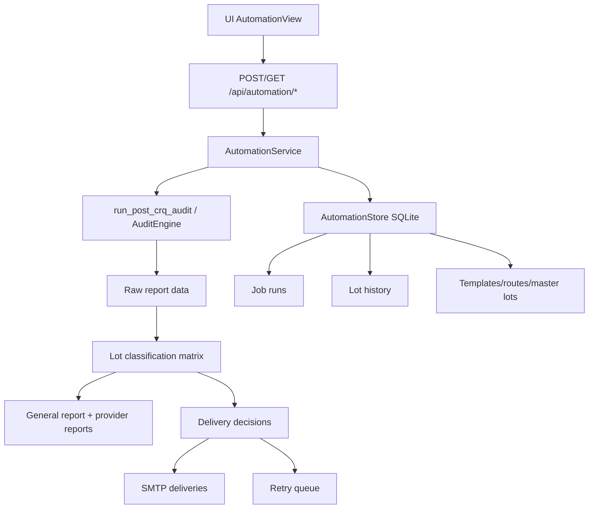
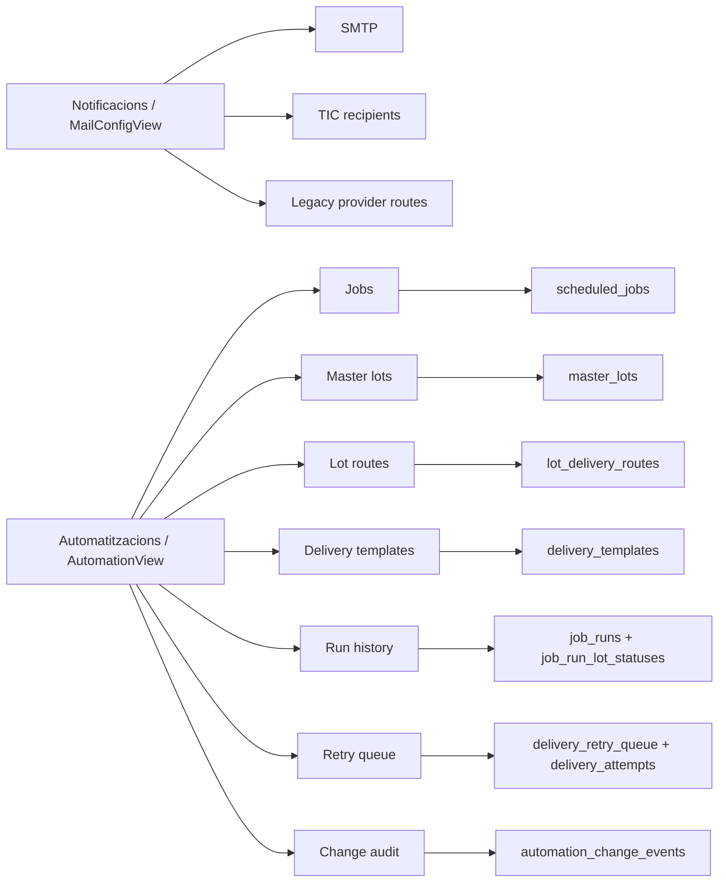

# Guia d'ajuda: Automatitzacions

## Objectiu

Aquest document explica com funciona l'apartat d'`Automatitzacions` de l'aplicació, com es configura i com es relaciona amb `Notificacions`, `Auditoria de canvis` i l'històric d'execucions.

S'ha construït a partir del codi real del repositori. He intentat usar `CodeGraphContext`, però en aquesta sessió el servidor MCP no ha pogut arrancar: `timed out handshaking with MCP server after 10s`. Per tant, el mapa de codi s'ha fet amb inspecció directa del repositori. Els diagrames Mermaid sí que han estat validats amb el MCP de Mermaid.

## On es veu cada cosa a la UI

- `Auditoria BBDD > Automatitzacions`
  - crear i editar jobs
  - veure el catàleg mestre de lots
  - editar destinataris per lot
  - editar plantilles
  - consultar l'històric per execució/lote
  - gestionar la cua de reenvio
  - veure auditoria de canvis
- `Notificacions`
  - configurar SMTP
  - configurar destinataris TIC del resum general
  - configurar rutes legacy `provider_code -> emails`

## URLs correctes

- `http://localhost:5175/`
  - frontend de desenvolupament. Aquesta és la URL correcta per fer servir la UI.
- `http://127.0.0.1:8011/docs`
  - documentació Swagger de l'API.
- `http://127.0.0.1:8011/`
  - API, no interfície web.

## Mapa funcional



## Mapa de pantalles i dades



## Peces principals del sistema

### 1. Jobs programats

Font de veritat:
- `scheduled_jobs`
- `delivery_targets`
- `severity_rules`

Responsabilitat:
- definir què s'executa
- amb quin perfil
- en quin horari
- quin format de report genera
- i, en el cas de distribució Post-CRQ, quina política de lots i reports aplica

Fitxers clau:
- `src/core/automation_store.py`
- `src/api/main.py`
- `src/api/automation_service.py`
- `src/web-app/src/views/AutomationView.jsx`

### 2. Execucions

Font de veritat:
- `job_runs`

Cada execució desa:
- inici i fi
- estat final: `running`, `success`, `partial_error`, `error`
- resum
- ruta del report generat
- lliuraments fets
- tasques creades

### 3. Històric per lot

Font de veritat:
- `job_run_lot_statuses`

Cada fila representa el resultat funcional d'un lot dins una execució:
- `lot`
- `detection_status`
- `num_findings`
- `report_generated`
- `email_sent`
- `motivo_sin_envio`
- `observaciones`
- `delivery_audience`
- `delivery_result`

Aquest és el registre que has de mirar quan vols saber:
- si un lot tenia hallazgos
- si s'ha generat el PDF
- si s'ha enviat
- per què no s'ha enviat

### 4. Destinataris i rutes

Hi ha dues capes convivint:

- Capa global a `Notificacions`
  - `tic_summary_recipients`
  - `provider_routes_json`
- Capa nova a `Automatitzacions`
  - `master_lots`
  - `lot_delivery_routes`

La intenció actual del sistema és:
- el resum general per TIC surt de `tic_summary_recipients`
- els PDFs per proveïdor surten de `lot_delivery_routes`
- si cal, es manté compatibilitat amb les rutes legacy

### 5. Plantilles

Font de veritat:
- `delivery_templates`

Plantilles per audiència:
- `tic_summary`
- `provider_with_findings`
- `manual_resend`

Variables suportades pel motor actual:
- `{job_name}`
- `{profile}`
- `{lot}`
- `{status}`
- `{findings}`
- `{execution_id}`
- `{observations}`
- `{summary}`

Renderitzat:
- es fa al backend amb `str.format_map(...)`
- si falta una variable, es deixa tal qual entre claus

## Tipus de job disponibles

### `post_crq`

Executa l'auditoria de canvis i genera un report general.

### `post_crq_distribution`

És el job important de distribució per lots. Fa això:

1. executa Post-CRQ
2. construeix una matriu prèvia per lot
3. genera:
   - `general.pdf` si està activat el resum
   - `provider_<lot>.pdf` per cada lot amb hallazgos si està activat
4. envia:
   - resum a TIC
   - PDF individual al proveïdor del lot
5. desa:
   - ZIP final del run
   - manifest
   - històric per lot
   - intents d'entrega
   - cua de reenvio si hi ha errors recuperables o reenvio manual

## Com funciona la classificació per lot

La decisió de lliurament no surt del PDF. Surt d'una capa prèvia de classificació.

Fitxer clau:
- `src/api/post_crq_lot_status.py`

Estats actuals:
- `CON_HALLAZGOS`
- `SIN_HALLAZGOS`
- `NO_APLICA`
- `ERROR_CONSULTA`
- `SIN_MAPEO`

Semàntica:
- `CON_HALLAZGOS`
  - hi ha troballes atribuïdes al lot
- `SIN_HALLAZGOS`
  - el lot s'ha avaluat i no té troballes
- `NO_APLICA`
  - el lot queda fora d'abast en aquesta execució
- `ERROR_CONSULTA`
  - no es pot concloure correctament per un error tècnic
- `SIN_MAPEO`
  - hi ha dades però no es poden assignar de forma fiable a cap lot

Regla de distribució actual:
- només s'envia automàticament si el lot és `CON_HALLAZGOS`

## Com es configura un job de distribució

Pantalla:
- `Auditoria BBDD > Automatitzacions`

Camps principals:
- `Nom del job`
- `Tipus d'auditoria`
  - tria `Distribucio proveidors Post-CRQ`
- `Perfil`
- `Checks`
- `Time filter`
- `Data/hora inicial`
- `Timeout`
- `Àmbit de lots`
  - `all`
  - `selected`
- `Lots seleccionats`
  - només si l'àmbit és manual
- `Include summary`
  - genera i intenta enviar el resum TIC
- `Include lot reports`
  - genera PDFs individuals per lot amb hallazgos
- `Email subject` i `Email body`
  - plantilla base del job

Validacions actuals:
- si l'àmbit és `selected`, cal informar com a mínim un lot
- en distribució, com a mínim s'ha d'activar resum o reports individuals

## On es configuren els destinataris TIC

Pantalla:
- `Notificacions`

Bloc:
- `Rutes de distribució Post-CRQ`

Camp:
- `Resum complet per a l'Àrea TIC (CSV)`

Exemple:

```text
area.tic@exemple.com, cap.projecte@exemple.com
```

Sense això, el resum general falla amb:
- `No hi ha destinataris TIC configurats`

## On es configuren els destinataris per lot

Tens dues vies:

### Vía recomanada

Pantalla:
- `Auditoria BBDD > Automatitzacions`

Bloc:
- `Destinataris per lot`

Per cada ruta:
- `lot_code`
- `label`
- `emails`
- `enabled`

### Vía legacy / global

Pantalla:
- `Notificacions`

Bloc:
- `Mapa proveïdor - correus`

Serveix com a compatibilitat enrere per `provider_code -> emails`.

## Com es decideix si un correu s'envia o no

### Resum TIC

S'envia si:
- el job té `include_summary = true`
- existeix `general.pdf`
- hi ha `tic_summary_recipients`

Si no hi ha destinataris TIC:
- es registra error
- s'afegeix un element a la cua de reenvio

### PDF per lot

S'envia si:
- el lot està en `CON_HALLAZGOS`
- hi ha adjunt del lot
- hi ha destinataris configurats

Si falla alguna d'aquestes condicions:
- no s'envia
- queda traça a `job_run_lot_statuses`
- pot entrar a la cua de reenvio

## Resultats de lliurament que pots veure

En el detall per lot actual veuràs:
- `delivery_audience`
- `delivery_result`

Valors importants:
- `sent`
- `retry_pending`
- `delivery_error`
- `no_route`
- `attachment_error`
- `skipped_no_findings`
- `skipped_not_applicable`
- `manual_review`

Interpretació ràpida:
- `sent`
  - correu enviat correctament
- `retry_pending`
  - hi ha reintent automàtic pendent
- `no_route`
  - falten destinataris
- `attachment_error`
  - no s'ha pogut generar o recuperar l'adjunt
- `manual_review`
  - cas no automàtic: `ERROR_CONSULTA` o `SIN_MAPEO`

## Reintents i cua de reenvio

Hi ha dues vies:

### Reenvio manual

Des de l'històric per lot:
- botó `Encola`

Després surt a:
- `Cua de reenvio manual`

I es pot executar amb:
- `Run now`

### Reintent automàtic

Per errors transitoris d'entrega, el backend crea un item a:
- `delivery_retry_queue`

Backoff actual:
- `5 min`
- `15 min`
- `60 min`

Control:
- `retry_mode`
- `attempts_made`
- `next_attempt_at`
- `max_attempts`
- `error_class`

Fitxers clau:
- `src/api/automation_service.py`
- `src/core/automation_store.py`

## Històric d'execucions: com llegir-lo

Pantalla:
- `Auditoria BBDD > Automatitzacions`

Bloc:
- `Historic d execucions`

Nivell run:
- job
- inici
- estat
- resum per lots
- descàrrega d'informe
- export CSV

Nivell lot:
- lot
- estat de detecció
- hallazgos
- audiència
- resultat entrega
- report generat
- enviament
- observació

Filtres disponibles actualment:
- `Estat`
- `Audiencia`
- `Resultat entrega`
- `Text lot`

## Auditoria de canvis

Pantalla:
- `Auditoria BBDD > Automatitzacions`

Bloc:
- `Auditoria de canvis`

Persistència:
- `automation_change_events`

Registra canvis sobre:
- `master_lots`
- `lot_delivery_routes`
- `delivery_templates`
- backfill del catàleg mestre
- canvis globals de `delivery_routes`

Camps típics:
- `entity_type`
- `entity_key`
- `action`
- `actor`
- `reason`
- `before`
- `after`

## Backfill schema_lots -> catàleg mestre

Pantalla:
- `Auditoria BBDD > Automatitzacions`

Bloc:
- `Backfill assistit schema_lots`

Ús:
1. genera preview
2. revisa lots nous o conflictes
3. selecciona quins vols aplicar
4. crea entrades a `master_lots`

No substitueix `schema_lots`; el complementa.

## Endpoints clau

### Jobs i runs
- `GET /api/automation/jobs`
- `POST /api/automation/jobs`
- `PUT /api/automation/jobs/{job_id}`
- `POST /api/automation/jobs/{job_id}/run-now`
- `GET /api/automation/runs`
- `GET /api/automation/runs/{run_id}/lots`
- `GET /api/automation/runs/{run_id}/lots/export.csv`
- `GET /api/automation/runs/{run_id}/report`

### Configuració
- `GET /api/automation/delivery-routes`
- `PUT /api/automation/delivery-routes`
- `GET /api/automation/master-lots`
- `PUT /api/automation/master-lots`
- `GET /api/automation/lot-routes`
- `PUT /api/automation/lot-routes`
- `GET /api/automation/delivery-templates`
- `PUT /api/automation/delivery-templates`

### Trazabilitat
- `GET /api/automation/change-events`
- `GET /api/automation/delivery-attempts`
- `GET /api/automation/retry-queue`
- `POST /api/automation/retry-queue`
- `POST /api/automation/retry-queue/{queue_id}/run-now`

## Fitxers clau del codi

- `src/web-app/src/views/AutomationView.jsx`
  - pantalla principal d'Automatitzacions
- `src/web-app/src/views/MailConfigView.jsx`
  - SMTP, TIC i rutes globals
- `src/web-app/src/App.jsx`
  - navegació de pestanyes i subtabs
- `src/api/main.py`
  - contracte HTTP de l'API
- `src/api/automation_service.py`
  - execució real dels jobs, generació de reports, enviaments i retries
- `src/api/post_crq_lot_status.py`
  - classificació prèvia per lot
- `src/core/automation_store.py`
  - persistència SQLite

## Flux operatiu recomanat

1. Configura SMTP a `Notificacions`.
2. Omple els destinataris TIC a `Notificacions`.
3. Revisa o completa `Destinataris per lot` a `Automatitzacions`.
4. Revisa les `Plantilles per audiencia`.
5. Crea el job `Distribucio proveidors Post-CRQ`.
6. Fes una execució manual primer.
7. Revisa:
   - històric per lot
   - cua de reenvio
   - resultat d'entrega
8. Quan el comportament sigui correcte, deixa el job programat.

## Problemes típics

### "No hi ha destinataris TIC configurats"

Solució:
- ves a `Notificacions`
- omple `Resum complet per a l'Àrea TIC (CSV)`

### "No hi ha destinataris configurats per al lot"

Solució:
- ves a `Automatitzacions > Destinataris per lot`
- o bé a `Notificacions > Mapa proveïdor - correus`

### "Carregant automatitzacions..."

Revisió ràpida:
- usa `http://localhost:5175/`
- comprova l'API a `http://127.0.0.1:8011/docs`
- si cal, reinicia `8011` i `5175`

## Limitacions actuals

- `CodeGraphContext` no ha estat disponible en aquesta sessió MCP.
- La configuració TIC encara es fa a `Notificacions`, no directament a `Automatitzacions`.
- `8011` és API, no UI.
- `8000` pot no reflectir sempre l'estat més fiable per provar Automatitzacions en desenvolupament.

## Resum curt

Si ho vols entendre ràpid:

- `Notificacions` = canals globals i resum TIC
- `Automatitzacions` = jobs, lots, plantilles, historial i reenvios
- `post_crq_distribution` = el job que reparteix resum TIC + PDFs per lot
- la decisió d'enviament surt de la classificació per lot, no del PDF
- si falta TIC o falta un destinatari de lot, el sistema ho registra i pot deixar-ho a la cua de reenvio
