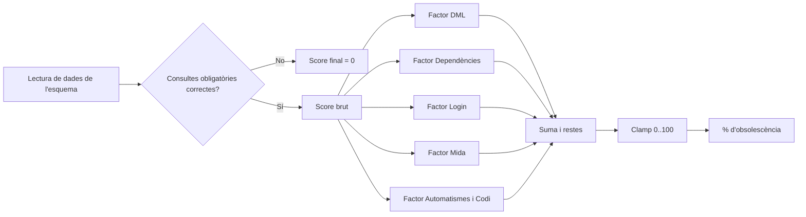
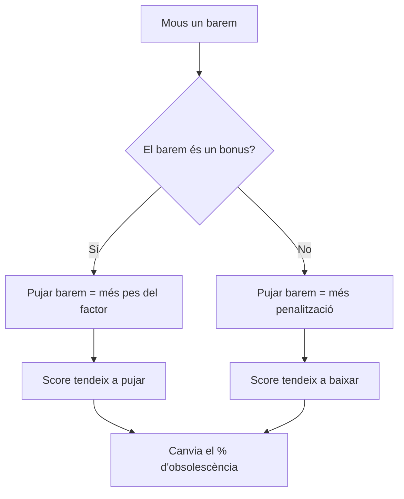

## Com funciona el càlcul del `% d'obsolescència`

El resultat final és un percentatge de **risc d'obsolescència**.

- **Com més alt**, més candidat a neteja.
- **Com més baix**, menys candidat a neteja.
- Si falla una consulta obligatòria, el sistema **invalida la nota** i fixa el resultat a `0`.

### Flux general del càlcul

### Fórmula resum

`score = DML + DEP + LOGIN + SIZE +/- AUTO`

`final = clamp(round(score), 0, 100)`

## Com afecta moure cada barem

### 1) DML

- **Punts DML sense activitat**
  - Si el puges, quan no hi ha activitat recent, el score puja més.
  - Si el baixes, aquest cas pesa menys.

### 2) Dependències

- **Màxim punts dependències**
  - Marca el sostre del factor dependències.
  - Si el puges, aquest factor pot aportar més punts.
- **Penalització per dep. entrant**
  - Si la puges, cada dependència entrant resta més dins del càlcul del factor.
- **Penalització per dep. sortint**
  - Igual que l'anterior, però per dependències sortints.

### 3) Login

- **Punts login inactiu**
  - Si el puges, un login molt antic suma més obsolescència.
- **Dies d'inactivitat login**
  - Si el puges, costa més considerar un compte com a "inactiu".
  - Si el baixes, més esquemes entren en inactivitat.

### 4) Mida

- **Llindar mida petita (GB)** i **Punts mida petita**
  - Si `SIZE_GB < llindar petita`, suma `punts mida petita`.
  - Si puges els punts, aquest cas pesa més.
  - Si puges el llindar, més esquemes poden entrar en aquesta categoria.
- **Llindar mida mitjana (GB)** i **Punts mida mitjana**
  - Si no és petita però `SIZE_GB < llindar mitjana`, suma `punts mida mitjana`.
  - Si puges punts o llindar, més impacte en el score.

### 5) Automatismes i codi

- **Bonus sense bloquejadors**
  - Si no hi ha jobs, triggers, APEX ni referències de codi, s'afegeix aquest bonus.
- **Penalització per bloquejador**
  - Cada bloquejador detectat resta punts.
- **Topall penalització bloquejadors**
  - Limita la penalització màxima.

## Diagrama de l'efecte dels sliders

## Taula ràpida de referència

| Barem | Si el puges | Si el baixes |
|---|---|---|
| Punts DML sense activitat | + pes de la inactivitat DML | - pes de la inactivitat DML |
| Màxim punts dependències | + sostre del factor DEP | - sostre del factor DEP |
| Penalització dep. entrant/sortint | + càstig per dependències | - càstig per dependències |
| Punts login inactiu | + pes del login antic | - pes del login antic |
| Dies d'inactivitat login | + difícil considerar inactiu | + fàcil considerar inactiu |
| Punts mida petita/mitjana | + pes de mida reduïda | - pes de mida reduïda |
| Llindars de mida | + més esquemes en categoria | - menys esquemes en categoria |
| Bonus sense bloquejadors | + recompensa per esquema net | - recompensa per esquema net |
| Penalització per bloquejador | + càstig per risc operatiu | - càstig per risc operatiu |
| Topall penalització | + penalització màxima possible | - penalització màxima possible |
